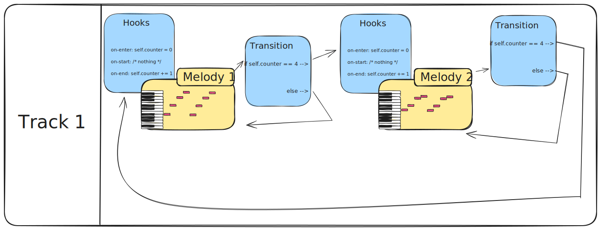

# Aurio

Some tagline here (happy to hear suggestions, I was thinking "The Audio Engine for Games" but it might be too pretentious).

## Intro - How this Software Came to Be

It's often the case that the first tools you use for a given task will strongly affect how you reason about that task.
The first DAW I've used was Fruity Loops (If we don't count the Nokia 3210 composer and Guitar Pro 4 that is), and
since then, I've been thinking of music production in terms of loops, patterns and how many times they repeat. As I
grew up as a musician and started using more "grown up" DAWs, I never felt as comfortable as I used to when using Fruity
Loops. Then Fruity Loops became FL Studio 6, then 7 then one day it was FL Stufio 10 and I just couldn't recognize it
anymore.

Aside from that, I was very fond of JRPGs on the Super Nintendo and already then, I noticed that Video Game Music was a
bit different. You get one song for one area and you might hear it for hours, so it needed to be loop-friendly. But I
also noticed another thing: sometimes it wouldn't loop the whole song. For example in Chrono Trigger's Millenial Fair
song, there's an intro you only hear once upon entering the fair, then the main loop starts. Then after playing
Monkey Island - LeChuck's Revenge, I noticed that the music could just slightly change without breaking from the main
loop, just to signal the presence of another character. And finally after discovering the live coding scene and seeing
how some musicians incorporated some randomness in the melodic sequences they put into their songs, I was facinated and
I wanted to be able to include that in my workflow. However, I didn't want to ditch my old habits and just start
writing music with code. I wanted to be able to leverage all the VSTs, MIDI devices and even real instruments in that
flow as well.

I wanted a software that felt familiar to me (Fruity Loops 3.56) and I thought for sure, it's 2026, no one is unique
anymore. If it's the perfect fit for me, it will be the perfect fit for other people. 

## The Vision

Going from the UX and working backwards to the technology that would enable it, I first thought of a graph based editor
where musicians can define sequences (as nodes) and transitions between them (as edges). This is much like Fruity
Loop's pattern system and how we organize those patterns in the track list, but the novelty comes from the fact that
transitions can be conditioned with a simple expression. For example if we want to play Sequence A 4 times before
transitionning over to Sequence B, we could instanciate a local `counter` inside Sequence A. That counter would be
incremented each time it plays to completion, and the transition over to B could have `counter == 4` as a condition.

The idea is to also support variables declared at the `track` level or in the `global` scope, and all of these could be
read from and written to by any node in the song.

In addition to MIDI Sequences, nodes can also be audio clips (rather straightforward) or code snippets that return an
array of MIDI events. This last one will be able to select a pitch, a start time and a duration based on the value of
other variables or an arithmetic result or a random number generator.

At this point you might be thinking "how on earth is THIS better than my current DAW?". I get it, this is not for
everyone. Also, I'm really still trying to figure out the right UX. However if you aren't thinking that then that's
great news to me! Please consider showing your support by starring this repo. As far as I'm concerned, even at this
stage, this way of writing music sounds adapted to what I want to do.

## Hierarchy of objects

At the top level, we have a `Project` (the terminology not definitive, this might be renamed to `Song` or `Score`).
- A Project has a name, a version, a BPM, a Sample Rate (for now it's always 44.1kHz), a sample library and Tracks
- A Track has an assigned `Instrument`, an envelope (`ADSRConfig`), a volume, a panning and a StateGraph.
- A StateGraph has Nodes and Edges
  - A Node has an id (String), a `Sequence` and some `Hooks`
  - An Edge has a `from`, a `to` (both node IDs), a condition (Lua expression), a Timing and an optional hook
- a Sequence can be `Static` and have a MIDI events or be `Generated` and have lua code that returns MIDI events

## File format

Originally, I wanted to come up with a new file format to describe these graph based songs. I wanted everything to fit
in a single file including all samples used. I also wanted a JSON based DSL (or JDSL) for the scripted sequences. In 
short, I wanted to create [The Most Amazing Software Ever Created](https://www.youtube.com/watch?v=QwUPs5N9I6I) 😁.

Jokes aside, I was originally thinking of having a custom language (not JSON based) but
a [Very Wise Man](https://github.com/0atman) told me "Just use Lua and RON". So here we are.

Project are folders with the `.aurio` extension. This is a common pattern for MacOS apps, Logic Pro studios are also
folders with the `.logicx` extension. For other platforms, it will be a bit less straightforward to deal with but it
should be fine too.

A `.aurio` project folder contains a `project.ron` which is a simple serialization of the `Project` struct. As well as
a `samples/` folder with will contain the samples used in that project. For sharing projects between users, it's fine
to just zip and send. Git should be okay here too since the `project.ron` file is properly prettified.

An example project is shipped with this commit at [./TestProject.aurio/](./TestProject.aurio/)
